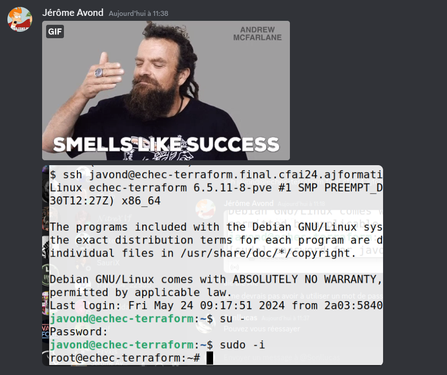

## <u>Nom du groupe :</u> Echec
### <u>Membres du groupe :</u> Mathis Tourier Thomas Rolland Lucas Bouchet Lucas Bruyere

_________________________

## <u>Configuration de base :</u>

<u>Configuration Container Terraform :</u>

| <u>Élements</u>        | <u>Caractéristiques</u>
| ------------- |:--------------:|
ID              |203
OS              |Debian
Processeur      |2 
Coeur           |2
Mémoire         |1Go 
Disque          |8Go 
Nom d'hôte      |echec-terraform
Domaine DNS     |final.cfai24.ajformation.fr

<u>Adresses IP :</u> 
Container : 2a03:5840:111:1024:aaaa:bbbb:cccc:0001

Instance BDD : 2a03:5840:111:1024:aaaa:bbbb:cccc:0002

Vitrine instance : 2a03:5840:111:1024:aaaa:bbbb:cccc:0003

Gestion instance : 2a03:5840:111:1024:aaaa:bbbb:cccc:0004

<u>Comptes utilisateurs :</u>

| <u>Utilisateur</u>        | <u>Mot de passe</u>
| ------------- |:--------------:|
| javond        |   Echec&Mat5       
| mtourier      | ******            
| trolland      | ******         
| lbruyere      | ******     
| lbouchet      | ******    

_________________________
## <u>Sécurité : </u>

Pour la sécurité de nos serveurs nous avons choisis de bloqué l'accès à l'utilisateur root en connexion ssh et les accès des utilisateurs sans leurs clé ssh.
Il faudra donc déjà être connecté avec un utilisateur classique afin de pouvoir se connecté en root. 

Pour ne pas avoir besoin de passer en root pour utiliser sudo (pour l'utilisateur : javond) il faut dans un premier temps executer cette commande : usermod -aG sudo javond

Puis  ajouter cette ligne : javond ALL=(ALL) NOPASSWD: ALL
dans le fichier : sudo visudo
_________________________

## <u>Test :</u> 

Afin de confirmé que les utilisateur arrivent bien à se connecter à notre machine, nous avons tous testé les connexions & droits de chacun. 

